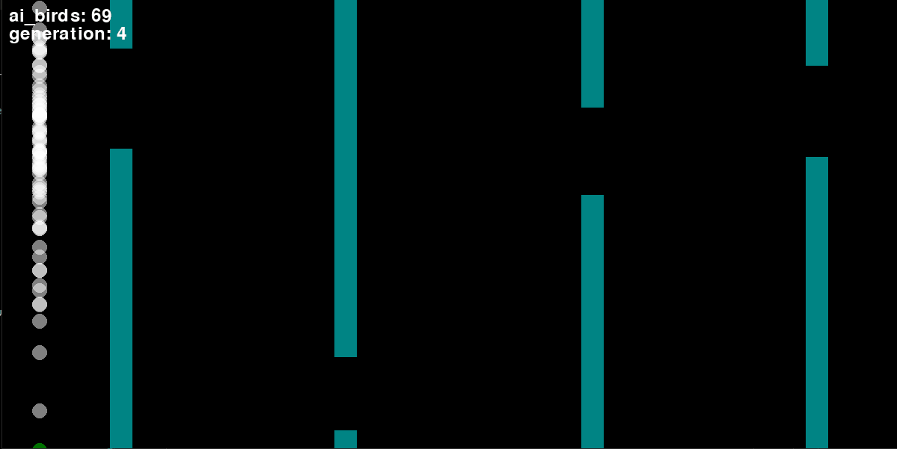

# My Neural Network

This is a Neural Network made from scratch in order to learn AI fundamentals and build intuition over it.

This is a spin-off of [my Virtual ML Master Course](https://github.com/sugaith/ml-master-course-ai-university).

It works impressively well.
It can play the game flawlessly in 3 to 9 generation with current settings and game-play.

## Structure

Find the NeuralNet class in [src/model/NeuralNet.py](./src/model/NeuralNet.py);

Find the Flappy-Bird game loop in [src/neural_net_test_games/flappy_bird_game.py](./src/neural_net_test_games/flappy_bird_game.py)

Find the genetic (Neural-evolution) algorithm in HERE

## Install & Run & Play

#### Install 

This Neural-net is made only with `numpy` and `pygame`.
But for those not use to Python: use Anaconda! To create an env in coda, open conda shell and:

- create and activate a conda env called neural-net
`conda create --name suga-neural-net python=3.9`
`conda activate suga-neural-net`

- to install packages
`conda install --file=requirements.txt`

#### Run & Play

So if you run the [NeuralNet.py](./src/model/NeuralNet.py) file, it has a XOR test where the net accurately predicts the output of XOR operation

To run the Flappy-Bird Game, run [flappy_bird_game.py](./src/neural_net_test_games/flappy_bird_game.py).

Hit `SPACE` to play along with the AI-Birds! the green bird is YOU

### Experiment with parameters

- Play with Ai-bird brain's inputs and hidden nodes in [Bird.py](./src/neural_net_test_games/Bird.py) class.
- Play with the neuro-evolution algorithm HERE

